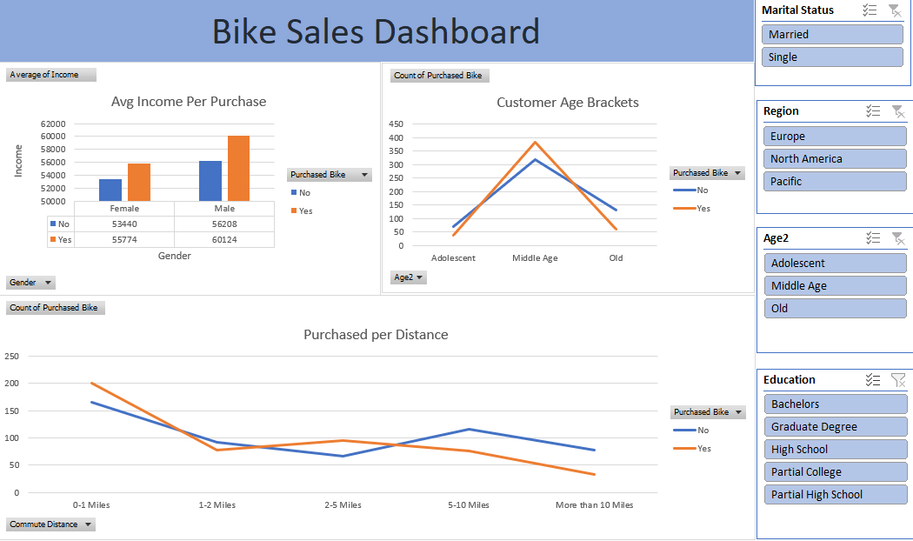
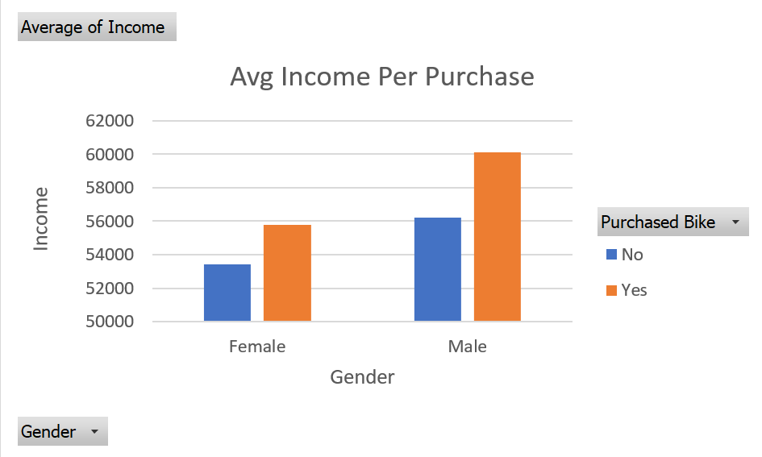
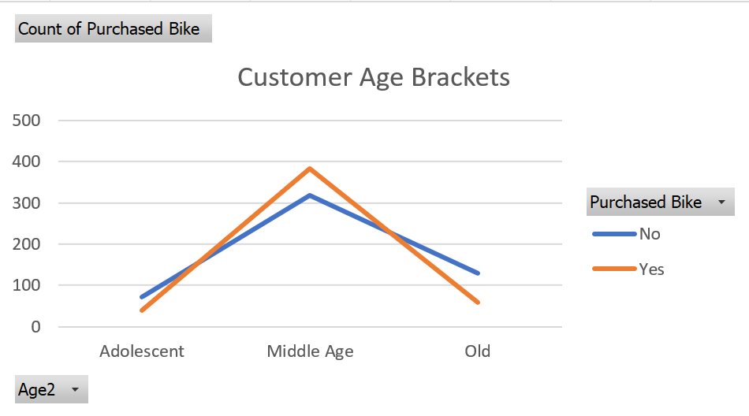
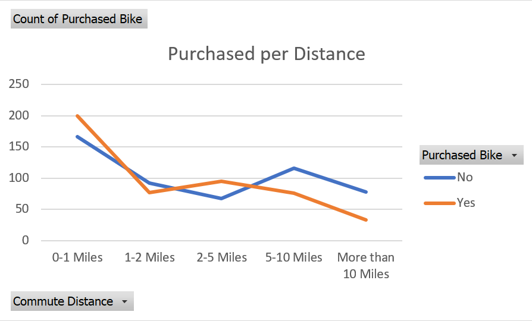

# Bike Sales Dashboard

## Overview
This project involved cleaning raw bike sales data and building 
an interactive Excel dashboard to analyze purchasing behavior 
across different customer segments. The dashboard includes slicers 
for marital status, region, age group, and education level
allowing filtering across all visuals to explore how 
different customer profiles influence bike purchase decisions.

## Dashboard Preview

## Key Insights

### 1. Income drives purchase decisions
Income is a consistent driver of bike purchases across both 
genders, customers who bought a bike earned a higher average 
income than those who didn't, with male buyers averaging $60,124 
compared to $56,208 for non-buyers.

### 2. Middle aged(31 -54) customers purchase the most
The data shows a clear peak in bike purchases among middle-aged 
customers, significantly outpacing both adolescents and older 
age groups.

### 3. Short commutes drive the most purchases
Customers commuting 0-1 miles show the highest purchase count, 
declining steadily as commute distance increases beyond 2 miles.

## Tools Used
Microsoft Excel — data cleaning, pivot tables, charts, slicers
